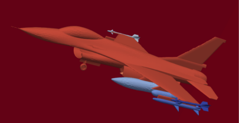

# MeshConverter
A format converter for surface mesh intergrated with small tools for fast surface mesh modification in CFD application scenarios.
## Build and installation
If eigen already exists in your computer, set environment ```EIGEN_BASE``` to skip download eigen from gitlab.
## Supported fileformat
Including *ASCII* based `vtk`,`pls`,`facet`,`msh`,`obj`. 
## Converter file format
example
```shell
MeshConverter -i example.pls -t
```
Here `-i` followed by the input filename, with `-t` for output type.

## Supported tools
Tools avaliable are list as bellow
```shell
MeshConveter
Usage: F:\mesh\dixing\beidapo\meshconverter\build\Debug\MeshConverter.exe [OPTIONS]
Options:
  -h,--help                   Print this help message and exit
  -b FLOAT ...                input bounding box. Format is (length, width, hight)
  -r FLOAT ...                input rotate param. Format is (start_x, start_y, start_z, end_x, end_y, end_z, angle) or (end_x, end_y, end_z, angle). angle value scale is (0, 2).
  -i TEXT REQUIRED            input filename. (string, required, supported format: vtk, mesh, pls, obj)
  -p TEXT                     output filename. (string, required)
  -k                          Write mesh in VTK format.
  -e                          Set eps in VTK format.
  -m                          Write mesh in MESH/MEDIT format.
  -y                          Write mesh in PLY format.
  -s                          Write mesh in PLS format.
  -f                          Write mesh in facet format.
  -o                          Write mesh in OBJ format.
  --reverse_orient            Reverse Facet Orient.
  --reset_orient              Regularize oritation
  --reset_orient_faceid       Regularize oritation and reset the facet mask by connected graph compoment index.
  --rm_zero_area              Repair mesh file for the facet's area that equal to zero.
```


### Reorient the mesh
reset the oritation by DFS, the connected componment with biggest volume will be set pointed to the internal. The mask will also set as connected compoment index if `--reset_orient_Faceid` is checked.
 $\Rightarrow$ 

### Reverse the orientation
Reverse all the orientaion of facets
### Add bounding box
Add a bounding box by example mesh
### Remove degenerated mesh element
Repair mesh file that exist zero aera facets. 

